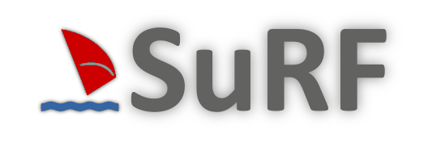

.. SuRF documentation master file, created by
   sphinx-quickstart on Thu Aug 06 22:30:56 2009.
   You can adapt this file completely to your liking, but it should at least
   contain the root `toctree` directive.

Welcome to SuRF's documentation!
================================

SuRF is an Object - RDF Mapper based on the popular rdflib python library.
It exposes the RDF triple sets as sets of resources and seamlessly integrates them
into the Object Oriented paradigm of python in a similar manner as ActiveRDF does for ruby.

.. toctree::
   :maxdepth: 2
   
   install
   plugins
   build
   
Indices and tables
==================

* :ref:`genindex`
* :ref:`modindex`
* :ref:`search`

Modules
=======

.. toctree::
   :maxdepth: 2
   
   modules/namespace
   modules/query
   modules/resource
   modules/serializer
   modules/session
   modules/store
   modules/util
   modules/plugin

Examples
========

.. toctree::
   :maxdepth: 2
   
   examples/dbpedia
   examples/allegro