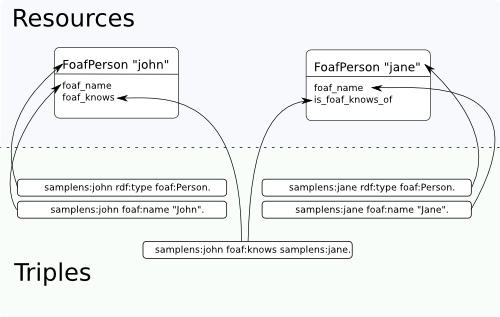

Resources and Classes
=====================
 
`SuRF` :class:`surf.resource.Resource` objects are the core part of `SuRF`. In `SuRF`,
`RDF` data is queried, accessed and modified by working with attributes of `Resource` objects.
Here's how the `SuRF` `Resource` maps to the RDF triples conceptual level:

.. testsetup::

	import surf
	store = surf.Store(reader = "rdflib", writer = "rdflib")
	session = surf.Session(store)	
	FoafPerson = session.get_class(surf.ns.FOAF.Person)
	john = session.get_resource("http://john.com/me", FoafPerson)
	jane = session.get_resource("http://jane.com/me", FoafPerson)
	# John
	john.foaf_name = "John"
	john.foaf_surname = "Smith"
	john.foaf_knows = jane
	john.save()
	# Jane
	jane.foaf_name = "Jane"
	jane.foaf_surname = "Doe"
	jane.foaf_knows = john
	jane.save()
	# Resource
	resource = session.get_resource("http://resource.com/me", surf.ns.OWL.Thing)

Getting a single Resource object
--------------------------------

If type and URI of resource is known, resource can be loaded using session's 
:meth:`surf.session.Session.get_class` and 
:meth:`surf.session.Session.get_resource` methods:

.. testcode::

	# Create FoafPerson class:
	FoafPerson = session.get_class(surf.ns.FOAF.Person)
	# Create instance of FoafPerson class:
	john = session.get_resource("http://john.com/me", FoafPerson)
	# or simply like this
	john = FoafPerson("http://john.com/me")

Loading multiple resources
--------------------------

Getting all instances of `FoafPerson` class, in undefined order:

.. doctest::

	>>> FoafPerson = session.get_class(surf.ns.FOAF.Person)
	>>> for person in FoafPerson.all():
	...     print "Found person:", person.foaf_name.first
	Found person: ...
	Found person: ...
		
Getting instances of `FoafPerson` class named "John": 

.. doctest::

	>>> FoafPerson = session.get_class(surf.ns.FOAF.Person)
	>>> for person in FoafPerson.get_by(foaf_name = "John"):
	...     print "Found person:", person.foaf_name.first
	Found person: John
		
Getting ordered and limited list of persons:

.. doctest::

	>>> FoafPerson = session.get_class(surf.ns.FOAF.Person)
	>>> for person in FoafPerson.all().limit(10).order(surf.ns.FOAF.name):
	...     print "Found person:", person.foaf_name.first
	Found person: Jane
	Found person: John
	
Other modifiers accepted by ``all()`` and ``get_by`` are described in
:mod:`surf.resource.result_proxy` module.

Using resource attributes
-------------------------

A SuRF resource represents a single RDF resource. Its URI is stored in
``subject`` attribute:

.. doctest::

	>>> FoafPerson = session.get_class(surf.ns.FOAF.Person)
	>>> john = session.get_resource("http://john.com/me", FoafPerson)
	>>> print john.subject 
	http://john.com/me

RDF triples that describe this resource are available as object attributes.
SuRF follows "prefix_predicate" convention for attribute names. These
attributes are instances of :class:`surf.resource.value.ResourceValue` class. 
They are list-like, with some extra convenience functions:

.. doctest::

	# Print all foaf:name values:
	>>> print john.foaf_name
	[rdflib.Literal(u'John')]	

	# Print first foaf:name value or None if there aren't any:
	>>> print john.foaf_name.first
	John	
	
	# Print first foaf:name value or raise exception if there aren't any or 
	# there are more than one:
	>>> print john.foaf_nonexistant_predicate.one
	Traceback (most recent call last):
	...
	NoResultFound: list is empty
	

RDF triples that have resource as object, are available as "inverse" 
attributes, they follow "is_prefix_predicate_of" convention:

.. doctest::

	# Print all persons that know john:
	>>> print john.is_foaf_knows_of
	[<surf.session.FoafPerson object at ...>]

Alternatively, dictionary-style attribute access can be used. It is 
useful in cases where "prefix_predicate" naming convention would yield
attribute names that are not valid in Python, like "vcard_postal-code".
It can also be used for easy iterating over a list of attributes:

.. doctest::
	
	>>> for attr in ["name", "surname"]: print john["foaf_%s" % attr].first
	John
	Smith
		
	# URIRefs are also accepted as dictionary keys:
	>>> for attr in ["name", "surname"]: print john[surf.ns.FOAF[attr]].first
	John
	Smith

Attributes can be used as starting points for more involved querying:

.. doctest::

	# Get first item from ordered list of all friends named "Jane": 
	>>> john.foaf_knows.get_by(foaf_name = "Jane").order().first()
	<surf.session.FoafPerson object at ...>

Modifiers accepted by attributes are described in 
:mod:`surf.resource.result_proxy` module.

Saving, deleting resources
--------------------------

Saving a resource:

.. testcode::

	resource.save()
	
Deleting a resource:

.. testcode::

	resource.remove()	

SuRF will allow instantiate resource with any URI and type, regardless of
whether such resource is actually present in triple store. To tell if
instantiated resource is present in triple store use 
:meth:`surf.resource.Resource.is_present()` method:

.. doctest::

	>>> resource = session.get_resource("http://nonexistant-uri", surf.ns.OWL.Thing)
	>>> resource.is_present()
	False
	 	
	 	
Extending SuRF resource classes
-------------------------------

SuRF Resource objects are all instances of :class:`surf.resource.Resource`.
It is possible to specify additional classes that resources of particular 
RDF type should subclass. This lets applications add custom logic to resource 
classes based on their type. The mapping is defined at session level by 
populating ``mapping`` dictionary in session object:

.. testcode::

	class MyPerson(object):
		""" Some custom logic for foaf:Person resources. """
		
		def get_friends_count(self):
			return len(self.foaf_knows)
			
			
	session.mapping[surf.ns.FOAF.Person] = MyPerson
	
	# Now let's test the mapping
	john = session.get_resource("http://example/john", surf.ns.FOAF.Person)
	
	# Is `john` an instance of surf.Resource? 
	print isinstance(john, surf.Resource)	
	# outputs: True
	
	# Is `john` an instance of MyPerson?
	print isinstance(john, MyPerson)
	# outputs: True
	
	# Try the custom `get_friends_count` method:
	print john.get_friends_count()
	# outputs: 0

.. testoutput::
	:hide:

	True
	True
	0	
	 	